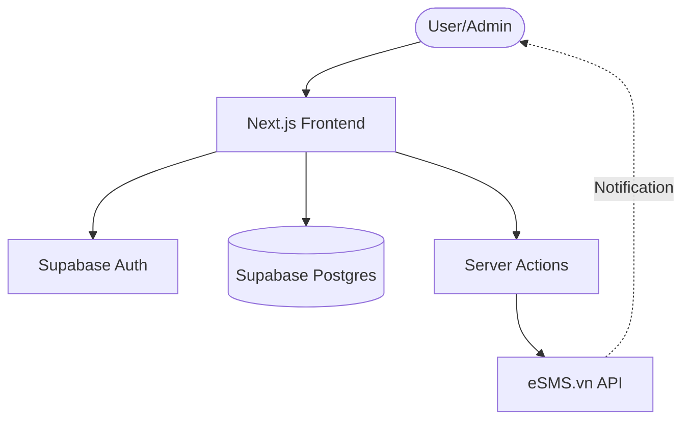

# 🌴 Leave Request Hub

[](https://nextjs.org/)
[](https://supabase.com/)
[](LICENSE)

Leave Request Hub is a professional, high-performance leave management system built for modern workplaces. It streamlines the employee leave application process and provides administrators with a powerful dashboard for approvals and workforce tracking.

## 📖 Table of Contents
- [✨ Key Features](#-key-features)
- [🏗️ System Architecture](#️-system-architecture)
- [🛠️ Tech Stack](#️-tech-stack)
- [🚀 Quick Start](#-quick-start)
- [🔐 Environment Configuration](#-environment-configuration)
- [📁 Project Structure](#-project-structure)
- [🤝 Contributing](#-contributing)
- [📄 License](#-license)

---

## ✨ Key Features

### For Employees
- **Smart Leave Application**: Intuitive form to request leaves with just a few clicks.
- **Real-time Status Tracking**: Monitor the status of your requests (Pending, Approved, Rejected).
- **Automated Notifications**: Receive SMS alerts via eSMS.vn when your request is processed.
- **Leave History**: Comprehensive overview of your past and upcoming leaves.

### For Administrators
- **Management Dashboard**: Centralized view of all leave requests across the company.
- **One-Click Approval**: Process applications efficiently with the ability to add remarks.
- **System Settings**: Configure automated reminder frequency and system flags.
- **Real-time SMS Logs**: Track outgoing notifications and their delivery status.

---

## 🏗️ System Architecture

The application follows a modern serverless architecture utilizing Next.js for the interface and Supabase for backend services.



---

## 🛠️ Tech Stack

- **Framework**: [Next.js 15](https://nextjs.org/) (App Router)
- **Database & Auth**: [Supabase](https://supabase.com/)
- **Styling**: [Tailwind CSS 4](https://tailwindcss.com/)
- **Forms & Validation**: [React Hook Form](https://react-hook-form.com/) + [Zod](https://zod.dev/)
- **Icons**: [Lucide React](https://lucide.dev/)
- **Notifications**: [eSMS.vn](https://esms.vn/)

---

## 🚀 Quick Start

### Prerequisites
- Node.js 20+
- A Supabase Project
- An eSMS.vn API Key

### Installation

1. **Clone the repository:**
   ```bash
   git clone https://github.com/yourusername/leave-request-hub.git
   cd leave-request-hub/leave-request-app
   ```

2. **Install dependencies:**
   ```bash
   npm install
   ```

3. **Configure environment variables:**
   ```bash
   cp .env.example .env.local
   # Update .env.local with your credentials
   ```

4. **Run the development server:**
   ```bash
   npm run dev
   ```

Open [http://localhost:3000](http://localhost:3000) with your browser to see the result.

---

## 🔐 Environment Configuration

| Variable | Description |
| :--- | :--- |
| `NEXT_PUBLIC_SUPABASE_URL` | Your Supabase project URL |
| `NEXT_PUBLIC_SUPABASE_ANON_KEY` | Supabase anonymous API key |
| `SUPABASE_SERVICE_ROLE_KEY` | Service role key for admin operations |
| `ESMS_API_KEY` | API Key from eSMS.vn |
| `ESMS_SECRET_KEY` | Secret Key from eSMS.vn |
| `CRON_SECRET` | Secret to secure scheduled notification routes |

---

## 📁 Project Structure

```text
leave-request-app/
├── src/
│   ├── app/            # Next.js App Router (Pages & Layouts)
│   ├── components/     # Reusable UI & Logic components
│   ├── lib/            # Shared utilities and API services
│   └── styles/         # Global styles and Tailwind configuration
├── supabase/           # Migrations and database schema
└── public/             # Static assets
```

---

## 🤝 Contributing

Contributions are what make the open source community such an amazing place to learn, inspire, and create. Any contributions you make are **greatly appreciated**.

1. Fork the Project
2. Create your Feature Branch (`git checkout -b feature/AmazingFeature`)
3. Commit your Changes (`git commit -m 'Add some AmazingFeature'`)
4. Push to the Branch (`git push origin feature/AmazingFeature`)
5. Open a Pull Request

---

## 📄 License

Distributed under the MIT License. See `LICENSE` for more information.

---
Built with ❤️ by [tuanasish](https://github.com/tuanasish)

